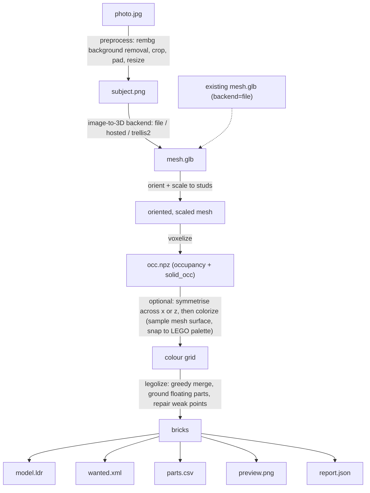

# image2lego

Turn a single product photo (or an existing 3D mesh) into a buildable LEGO
model: an LDraw file you can open in BrickLink Studio, a BrickLink Wanted
List to buy the parts, a human-readable parts CSV, and a rendered preview
image.

It handles the whole pipeline -- image-to-3D generation, orienting and
scaling the mesh to a stud grid, voxelizing, sampling the mesh's surface
colour onto the voxel grid and snapping it to a real LEGO colour palette,
greedily merging voxels into actual brick/plate parts, and then repairing
the result so it's a single physically-connected structure with a
simplified stability check -- and exposes it as a CLI and a small web UI.

## How it works



Each stage's intermediate artefact (`subject.png`, `mesh.glb`, `occ.npz`) is
saved in the output directory, so any later stage can be re-run from it
directly (`image2lego voxelize`, `image2lego legolize`, ... -- see
[Usage](#usage) and `image2lego <command> --help`) without repeating the
expensive earlier steps. (For the invariants each stage is required to
preserve -- useful if you're modifying the pipeline rather than just running
it -- see [CONTRIBUTING.md](CONTRIBUTING.md).)

**1. Image to mesh.** A photo is background-removed, cropped/padded, and
handed to one of three interchangeable backends
(`image2lego/frontend/`): `file` (you already have a `.glb`, no photo step
needed), `hosted` (a hosted image-to-3D API), or `trellis2` (self-hosted
[TRELLIS.2](https://github.com/microsoft/TRELLIS.2), see `services/trellis2/`).
If you're starting from an existing mesh rather than a photo, this whole
stage is skipped.

**2. Orient and scale.** `geometry/mesh.py` picks the mesh's up-axis
(auto-detected as whichever extent is smallest, or forced with `--up`) and
scales it so its longer horizontal extent equals `--width` studs, with the
vertical axis quantized to whole brick or plate layers.

**3. Voxelize.** `geometry/voxelize.py` resamples the mesh onto that
stud/layer-aligned grid, producing a boolean occupancy array indexed
`[x, y, z]` (`y` counting up from the ground). `--hollow N` also carves out
everything more than `N` voxels from the surface, since a solid interior is
mostly wasted parts; the pre-hollow solid version is kept alongside it
(`solid_occ`) so later repair steps have interior space to route support
struts through.

**4. Colorize.** `geometry/colorize.py` samples the *original* mesh's
surface colour at each occupied voxel (with jittered multi-sample
averaging) and snaps it to the nearest colour in a real LEGO palette
(`image2lego/colours.py`, CIELAB nearest-neighbour) -- or to nothing, if no
`colors.csv` is installed (see [Install](#install)). `--symmetrise x|z`
mirrors the occupancy grid across that axis first, keeping whichever half
has more material, to paper over single-view reconstruction asymmetry.

**5. Legolize.** `legolize/` turns the coloured voxel grid into actual
brick/plate parts (1x1 up to 2x8, `model.py`'s `PartCatalogue`):
  - `greedy.py` merges each horizontal layer into the fewest/largest bricks
    it can, scanning from a randomised corner so repeated runs don't all
    seam in the same place; several random restarts are tried and the
    best-scoring one is kept.
  - `graph.py` models the result as a graph (bricks as nodes, an edge
    between two bricks on adjacent layers wherever their footprints
    overlap -- LEGO's stud-and-tube connection only works vertically, so
    that's the only kind of edge that exists) and finds structural weak
    points from it: articulation points, degree-1 bricks, and seams
    (a repeated straight joint across 3+ layers).
  - `repair.py` hill-climbs those weak points -- and, at higher priority,
    any outright disconnection between components -- by dissolving a small
    window around the problem and re-merging it, keeping the change only
    if it helps; anything still floating afterwards gets a vertical filler
    column down to the ground (through `solid_occ`) or, failing that, is
    dropped with a warning.
  - `stability.py` (opt-in; see [Known limitations](#known-limitations))
    solves a linear-programming relaxation of static equilibrium -- gravity
    against clutch-power stud connections and ground friction -- and can
    likewise hill-climb the most-stressed brick.

**6. Output.** The finished brick list is written out as an LDraw model
(`io/ldraw.py`), a BrickLink Wanted List and parts CSV (`io/bricklink.py`),
and a fast hand-rolled isometric preview render (`render.py`).

## Install

Requires Python 3.11+. Using [uv](https://docs.astral.sh/uv/) (recommended):

```bash
git clone <this repo>
cd image2lego
uv sync
```

This installs the core pipeline: geometry processing, voxelization,
colorizing, `legolize`, the LDraw/BrickLink writers, the stability checker,
and the CLI/web UI -- everything except photo background removal, which
needs the optional `frontend` extra ([rembg](https://github.com/danielgatis/rembg),
CPU-only ONNX inference, no GPU required):

```bash
uv sync --extra frontend
# or, with plain pip: pip install -e ".[frontend]"
```

Without the `frontend` extra, `--backend file` (an existing mesh, no photo
preprocessing) still works fully; `--backend hosted`/`--backend trellis2`
will fail as soon as they try to preprocess a photo, since that's where
`rembg` is used.

**A GPU is never required to run image2lego itself.** The only thing that
needs one is *optionally* self-hosting the [TRELLIS.2](https://github.com/microsoft/TRELLIS.2)
image-to-3D model locally instead of using a hosted API -- see
`services/trellis2/README.md` for that (Linux, NVIDIA GPU with >= 24 GB
VRAM, run via Docker; entirely separate from image2lego's own Python
dependencies).

You'll also need a Rebrickable `colors.csv` at `image2lego/data/colors.csv`
(id, name, rgb, is_trans, plus an LDraw/BrickLink id mapping -- see
`image2lego/colours.py`'s docstring for the accepted shapes) for colour
sampling, the wanted list, and the parts CSV to do anything; without it,
image2lego still produces a valid (uncoloured) model, with a warning.

## Usage

Every command has a full `--help`; this covers the common cases. Sizes
throughout are in studs (the horizontal grid unit); `--width` is always the
*longer* of the model's x/z extents, scaled to that many studs.

### `image2lego build` -- the full pipeline, in one command

```bash
# From a photo, using a hosted image-to-3D API
image2lego build photo.jpg --backend hosted --width 40 --bricks \
    --hollow 3 --symmetrise x --max-colours 6 --out outdir/

# From a mesh you already have (no image-to-3D step -- photo.jpg is still
# a required argument, but --mesh's geometry is what actually gets used)
image2lego build photo.jpg --backend file --mesh existing.glb \
    --width 40 --bricks --out outdir/
```

Writes `model.ldr`, `wanted.xml`, `parts.csv`, `preview.png`, and
`report.json` into `--out`, alongside the intermediate `subject.png`,
`mesh.glb`, and `occ.npz`. Key options:

| Flag | Meaning |
| --- | --- |
| `--backend file\|hosted\|trellis2` | Image-to-3D source (`file` needs `--mesh`) |
| `--width N` | Longer horizontal extent, in studs |
| `--plates` / `--bricks` (default) | Plate height (1/3 as tall) instead of brick height |
| `--hollow N` (default 3) | Shell thickness in voxels; `0` for a solid interior |
| `--up auto\|x\|y\|z` | Force the source mesh's up-axis instead of auto-detecting it |
| `--symmetrise x\|z` | Mirror-symmetrise the voxel grid before colorizing, keeping whichever half has more material -- useful for photographed objects that are approximately symmetric but whose single-view reconstruction wasn't |
| `--max-colours N` | Cluster surface colours down to at most N before palette-snapping |
| `--seed N` / `--restarts N` / `--repair-iters N` | Determinism and search-effort knobs for `legolize` (see below) |

### `image2lego check` -- structural stability, on any `.ldr`

```bash
image2lego check outdir/model.ldr
image2lego check outdir/model.ldr --t-max 2.0 --s-max 2.0  # stronger studs
```

Works on any LDraw file built from this project's own brick/plate parts in
a uniform brick-or-plate layer type -- your own output, or a compatible
Studio export -- and prints whether the model is in static equilibrium plus
its most-stressed bricks. `--t-max`/`--s-max` scale the assumed per-stud
clutch strength (tension/shear) if the default flags something you're
confident is actually fine.

### `image2lego serve` -- the web UI

```bash
image2lego serve --port 8000
```

Opens a single-page UI at `http://127.0.0.1:8000` that wraps the same
`build` pipeline: pick a backend (uploading a mesh for `file`, or a photo
for `hosted`/`trellis2`), set width/plates/hollow/symmetrise/max-colours,
submit, and watch the job's log stream in as it runs, with the same output
files downloadable when it finishes.

### Working stage-by-stage

`build`/`serve` run the whole pipeline at once, but each stage can also be
run and re-run independently -- useful for iterating on `legolize` without
re-voxelizing, or inspecting an intermediate result:

```bash
# mesh -> occupancy/colour grid
image2lego voxelize existing.glb --width 40 --bricks --out outdir/occ.npz

# occupancy/colour grid -> LDraw model (+ optional wanted-list XML)
image2lego legolize outdir/occ.npz --out outdir/model.ldr --xml outdir/wanted.xml

# occupancy/colour grid -> top/front/side views, in the terminal and as a PNG
image2lego preview outdir/occ.npz
```

### Using the Python API directly

The CLI doesn't expose every option -- notably, the stability-aware repair
pass (`legolize(..., stability=True)`) isn't wired up as a `build`/`legolize`
flag, since it's slower and most useful while iterating on a specific model:

```python
from image2lego.legolize import legolize
from image2lego.model import PartCatalogue

bricks = legolize(
    colours, solid_occ, PartCatalogue(), "brick",
    seed=0, restarts=4, repair_iters=200,
    stability=True, stability_iters=50, t_max=1.0, s_max=1.0,
)
```

`colours`/`solid_occ` are exactly what `voxelize`/`build` produce (and what's
saved in `occ.npz`'s `colours`/`solid_occ` arrays).

## Opening the result in BrickLink Studio

[Studio](https://www.bricklink.com/v3/studio/download.page) is BrickLink's
free LEGO CAD tool and the natural place to inspect, tweak, and act on
`model.ldr`.

1. **Open the model**: `File | Open`, pick `model.ldr`.
2. **Check it looks right**: the studs should point up, nothing should be
   floating, and (if you generated a staircase/cantilever-style shape)
   the overhang should look plausible. `image2lego check` (below) is the
   quantitative version of this.
3. **Run the stability check** (this is image2lego's own tool, not a
   Studio feature -- Studio has no equivalent): `image2lego check
   model.ldr`, or `--t-max`/`--s-max` to loosen/tighten the assumed stud
   clutch strength if the default flags something you're confident is
   fine. It reports whether the model is in static equilibrium under a
   simplified force model and lists the most-stressed bricks.
4. **Export/upload a wanted list**: image2lego already writes
   `wanted.xml` in BrickLink's own Wanted List XML format, uploadable
   directly at bricklink.com's Wanted List page -- no need to regenerate
   it. If you edit the model in Studio first, Studio can produce a fresh
   one straight from your edited version: click **Add to Wanted List**
   (the shopping-cart-with-a-plus icon, top right of the toolbar, next to
   Sign in), sign in when prompted, pick or name a list, **Proceed to
   verify items**, adjust condition/price/quantity as needed, then **Add
   to Wanted List**. (Studio can also just export the XML file locally
   via `File | Export As`, without uploading, if you'd rather import it
   by hand.)
5. **Export a parts list / BOM**: `File | Export As` -> CSV or TSV, if you
   want something other than image2lego's own `parts.csv`.
6. **Render an image**: click **Render** on the toolbar, choose quality,
   image size, and background (or transparent), and save -- a nicer,
   raytraced alternative to image2lego's own fast isometric `preview.png`.

## LEGO Ideas constraints

If you're building toward a [LEGO Ideas](https://ideas.lego.com/)
submission, keep in mind:

- **200-5000 elements.** `report.json` (and the CLI/web summary tables)
  report your brick count and whether it's in this window; `legolize`
  itself doesn't enforce it, since a valid build can fall outside it and
  still be worth generating.
- **No subject that's already licensed IP** unrelated to LEGO's own
  properties -- real car brands, other companies' characters, etc. are
  not eligible without that IP holder's own involvement.

**The Mustang example used while developing/testing this project is a
test subject only** -- it exercises the pipeline (a recognisable, curved,
asymmetric real-world object) but a real car brand's design is licensed
IP, so it is *not* an eligible LEGO Ideas subject on its own and shouldn't
be submitted as one.

## Known limitations

- **Single-view reconstruction artefacts.** Image-to-3D from one photo
  fills in unseen geometry, so the back/underside of the generated mesh
  is a guess, not a measurement -- expect it to be smoother, flatter, or
  just wrong compared to the real object, especially for shapes that
  aren't roughly symmetric (the `--symmetrise` option exists specifically
  to paper over some of this).
- **No slopes or curved parts.** The part catalogue
  (`image2lego/model.py`) is bricks and plates only -- axis-aligned
  rectangular boxes. Curved, angled, or sloped surfaces in the source mesh
  get voxelized into a blocky staircase approximation; there's no attempt
  to substitute slope/curve pieces for a smoother silhouette.
- **Simplified stability model.** `image2lego check` (and the underlying
  `image2lego.legolize.legolize(..., stability=True)`, not currently
  exposed as its own CLI flag) solve a *linear* relaxation of static
  equilibrium (see the module docstring in
  `image2lego/legolize/stability.py` for the full
  list of simplifications): point-contact studs, flat scalar force
  bounds instead of a Coulomb friction cone, no dynamic/impact loads, and
  yaw isn't balanced. Treat "feasible" as "plausible enough to be worth
  building," not as an engineering certification -- and treat this as a
  simplified model of a system that's already an approximation (an
  automatically-voxelized shape), not a substitute for actually looking
  at the model.
- **Colour fidelity depends on `colors.csv`.** Without a real Rebrickable
  colour file in place, nothing gets coloured at all (see Install,
  above); with one, colour matching is nearest-neighbour in CIELAB
  against a fixed ~20-colour palette (`image2lego/colours.py`), not the
  full range of colours LEGO actually produces.
- **The web UI is a demo.** In-memory job state and a background thread
  per job (`image2lego/web.py`) -- jobs don't survive a restart, there's
  no auth, and it's not meant to be exposed beyond localhost as-is.
