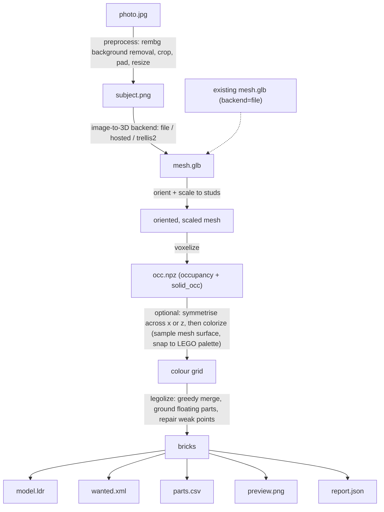

# image2lego

Turn a single product photo (or an existing 3D mesh) into a buildable LEGO
model: an LDraw file you can open in BrickLink Studio, a BrickLink Wanted
List to buy the parts, a human-readable parts CSV, and a rendered preview
image.

It handles the whole pipeline -- image-to-3D generation, orienting and
scaling the mesh to a stud grid, voxelizing, sampling the mesh's surface
colour onto the voxel grid and snapping it to a real LEGO colour palette,
greedily merging voxels into actual brick/plate parts, and then repairing
the result so it's a single physically-connected structure with a
simplified stability check -- and exposes it as a CLI and a small web UI.

## Pipeline



Each stage's intermediate artefact (`subject.png`, `mesh.glb`, `occ.npz`) is
saved in the output directory, so any later stage can be re-run from it
directly (`image2lego voxelize`, `image2lego legolize`, ... -- see
`image2lego <command> --help`) without repeating the expensive earlier
steps.

## Install

Requires Python 3.11+. Using [uv](https://docs.astral.sh/uv/) (recommended):

```bash
git clone <this repo>
cd image2lego
uv sync
```

This installs the core pipeline: geometry processing, voxelization,
colorizing, `legolize`, the LDraw/BrickLink writers, the stability checker,
and the CLI/web UI -- everything except photo background removal, which
needs the optional `frontend` extra ([rembg](https://github.com/danielgatis/rembg),
CPU-only ONNX inference, no GPU required):

```bash
uv sync --extra frontend
# or, with plain pip: pip install -e ".[frontend]"
```

Without the `frontend` extra, `--backend file` (an existing mesh, no photo
preprocessing) still works fully; `--backend hosted`/`--backend trellis2`
will fail as soon as they try to preprocess a photo, since that's where
`rembg` is used.

**A GPU is never required to run image2lego itself.** The only thing that
needs one is *optionally* self-hosting the [TRELLIS.2](https://github.com/microsoft/TRELLIS.2)
image-to-3D model locally instead of using a hosted API -- see
`services/trellis2/README.md` for that (Linux, NVIDIA GPU with >= 24 GB
VRAM, run via Docker; entirely separate from image2lego's own Python
dependencies).

You'll also need a Rebrickable `colors.csv` at `image2lego/data/colors.csv`
(id, name, rgb, is_trans, plus an LDraw/BrickLink id mapping -- see
`image2lego/colours.py`'s docstring for the accepted shapes) for colour
sampling, the wanted list, and the parts CSV to do anything; without it,
image2lego still produces a valid (uncoloured) model, with a warning.

## Usage

```bash
# Full pipeline from a photo, using a hosted image-to-3D API
image2lego build photo.jpg --backend hosted --width 40 --bricks \
    --hollow 3 --symmetrise x --max-colours 6 --out outdir/

# Full pipeline from a mesh you already have (no image-to-3D step)
image2lego build photo.jpg --backend file --mesh existing.glb \
    --width 40 --bricks --out outdir/

# Check any LDraw file's structural stability (yours, or one exported
# from Studio)
image2lego check outdir/model.ldr

# Web UI
image2lego serve --port 8000
```

`--symmetrise {x,z}` mirrors the voxel grid across that axis before
colorizing, keeping whichever half has more material (useful for
photographed objects that are approximately symmetric but whose
reconstruction wasn't).

## Opening the result in BrickLink Studio

[Studio](https://www.bricklink.com/v3/studio/download.page) is BrickLink's
free LEGO CAD tool and the natural place to inspect, tweak, and act on
`model.ldr`.

1. **Open the model**: `File | Open`, pick `model.ldr`.
2. **Check it looks right**: the studs should point up, nothing should be
   floating, and (if you generated a staircase/cantilever-style shape)
   the overhang should look plausible. `image2lego check` (below) is the
   quantitative version of this.
3. **Run the stability check** (this is image2lego's own tool, not a
   Studio feature -- Studio has no equivalent): `image2lego check
   model.ldr`, or `--t-max`/`--s-max` to loosen/tighten the assumed stud
   clutch strength if the default flags something you're confident is
   fine. It reports whether the model is in static equilibrium under a
   simplified force model and lists the most-stressed bricks.
4. **Export/upload a wanted list**: image2lego already writes
   `wanted.xml` in BrickLink's own Wanted List XML format, uploadable
   directly at bricklink.com's Wanted List page -- no need to regenerate
   it. If you edit the model in Studio first, Studio can produce a fresh
   one straight from your edited version: click **Add to Wanted List**
   (the shopping-cart-with-a-plus icon, top right of the toolbar, next to
   Sign in), sign in when prompted, pick or name a list, **Proceed to
   verify items**, adjust condition/price/quantity as needed, then **Add
   to Wanted List**. (Studio can also just export the XML file locally
   via `File | Export As`, without uploading, if you'd rather import it
   by hand.)
5. **Export a parts list / BOM**: `File | Export As` -> CSV or TSV, if you
   want something other than image2lego's own `parts.csv`.
6. **Render an image**: click **Render** on the toolbar, choose quality,
   image size, and background (or transparent), and save -- a nicer,
   raytraced alternative to image2lego's own fast isometric `preview.png`.

## LEGO Ideas constraints

If you're building toward a [LEGO Ideas](https://ideas.lego.com/)
submission, keep in mind:

- **200-5000 elements.** `report.json` (and the CLI/web summary tables)
  report your brick count and whether it's in this window; `legolize`
  itself doesn't enforce it, since a valid build can fall outside it and
  still be worth generating.
- **No subject that's already licensed IP** unrelated to LEGO's own
  properties -- real car brands, other companies' characters, etc. are
  not eligible without that IP holder's own involvement.

**The Mustang example used while developing/testing this project is a
test subject only** -- it exercises the pipeline (a recognisable, curved,
asymmetric real-world object) but a real car brand's design is licensed
IP, so it is *not* an eligible LEGO Ideas subject on its own and shouldn't
be submitted as one.

## Known limitations

- **Single-view reconstruction artefacts.** Image-to-3D from one photo
  fills in unseen geometry, so the back/underside of the generated mesh
  is a guess, not a measurement -- expect it to be smoother, flatter, or
  just wrong compared to the real object, especially for shapes that
  aren't roughly symmetric (the `--symmetrise` option exists specifically
  to paper over some of this).
- **No slopes or curved parts.** The part catalogue
  (`image2lego/model.py`) is bricks and plates only -- axis-aligned
  rectangular boxes. Curved, angled, or sloped surfaces in the source mesh
  get voxelized into a blocky staircase approximation; there's no attempt
  to substitute slope/curve pieces for a smoother silhouette.
- **Simplified stability model.** `image2lego check` (and the underlying
  `image2lego.legolize.legolize(..., stability=True)`, not currently
  exposed as its own CLI flag) solve a *linear* relaxation of static
  equilibrium (see the module docstring in
  `image2lego/legolize/stability.py` for the full
  list of simplifications): point-contact studs, flat scalar force
  bounds instead of a Coulomb friction cone, no dynamic/impact loads, and
  yaw isn't balanced. Treat "feasible" as "plausible enough to be worth
  building," not as an engineering certification -- and treat this as a
  simplified model of a system that's already an approximation (an
  automatically-voxelized shape), not a substitute for actually looking
  at the model.
- **Colour fidelity depends on `colors.csv`.** Without a real Rebrickable
  colour file in place, nothing gets coloured at all (see Install,
  above); with one, colour matching is nearest-neighbour in CIELAB
  against a fixed ~20-colour palette (`image2lego/colours.py`), not the
  full range of colours LEGO actually produces.
- **The web UI is a demo.** In-memory job state and a background thread
  per job (`image2lego/web.py`) -- jobs don't survive a restart, there's
  no auth, and it's not meant to be exposed beyond localhost as-is.
